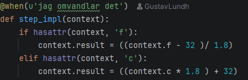

## 📊 Framsteg

| Del | Uppgift | Status |
|---|---|---|
| 1 | Temperaturomvandling | ✅ Klar |
| 2 | Lagerhållning | ✅ Klar |
| 3 | Bankkonto | ⬜ Ej påbörjad |
| 4 | Bibliotek | ⬜ Ej påbörjad |

# 1 Temperaturomvandling
Skriv tester med BDD för funktioner som omvandlar temperaturer från Fahrenheit till Celsius och tvärtom. Exempel på testfall:
Givet temperaturen 32°F, ska funktionen svara 0°C
Givet temperaturen 100°C, ska funktionen svara 212°F


# 2 Lagerhållning
Skriv tester med BDD för ett lagerhanteringssystem. Testa att
Det går att lägga till en valfri produkt: namn och antal är korrekt
Det går att minska antalet av en specifik produkt

Lite kod att börja med:
````class StockItem:
  def __init__(name, amount):
    self.name = name
    self.amount = amount

class Stock:
  def __init__(self):
    self.items = []
  def add_product(self, product):
    self.items.append(product)
````


# 3 Bankkonto
Skriv tester med BDD för ett bankkonto:
skapa nytt konto - saldot är noll
sätta in pengar
ta ut pengar
applicera 5% ränta
överföra pengar mellan två konton

Tips: Du kan återanvända koden du skrivit i tidigare veckouppgifter.


# 4 Bibliotek
Skriv tester med BDD för ett biblioteksystem, där man kan:
söka efter böcker baserat på titel 
söka efter böcker baserat på författare
låna en bok
lämna tillbaka en bok
kontrollera om en viss bok är utlånad eller inte

---

## 1. 
I uppgift nummer ett gjordes en tempomvandlare med hjälp av BDD.
Först gjordes en [Feature](features/temp_omvandlare.feature). 
Den testar scenariot om vi har ett tag i Farenheit som skall omvandlas till Celsius, Scenario nummer 2 testar om vi har Celsius och ska omvandla till Farenheit.
Båda fick taggarna ``@Smoke`` och ``@critical``.
Efter att behave kört fick vi koden för våra steps [Här](features/steps/temp_omvandlare_steps.py)
I denna uppgift kunde vi simplet implementera den matematiska forumlan direkt in i steps koden.


## 2. 
I denna uppgift skulle vi testa lägga till varor och plocka bort antal från en vara.
Samam här började jag med en [Feature](features/lagerhallning.feature).
I den finns två scenarios, lägga till vara samt minska antalet på en specifik vara.
Här fick vi lite kod att jobba med på förhand den finns [Här](src/lagerhållning/lagerhållning.py).
Vi har en ``StockItem`` class och en ``Stock`` class.
Behave körde och vi fick då våra [Steps](features/steps/lagerhallning_steps.py)
Jag deklarerar ``Stock()`` direkt på toppen för att undvika problem.
Efter detta behövde jag ändra i funktionerna för classerna för att få allt att funka.
Koden finner du [Här](src/lagerhållning/lagerhållning.py).
jag la till en ny funktion för att ta en product
````  
def take_a_product(self, product, amount):
      print("Produkt:", product) # Felsökning då jag fick problem med koden
      print("Items:", self.items)
      print("Finns produkten?", product in self.items)

      if product in self.items:
         product.amount -= amount
 `````
Jag la till lite prints för att konstatera vad som gick fel på vägen, de hela resulterade i att jag hade glömt att jag behöver ha två ``When`` i min Feature för att plocka bort.
Jag behöver lägga till varan i lagret ännu en gång vilket var något jag missade, men tack till denna felsökning kunde jag se att den inte funkade som den skulle.

# 3.
Jag han tyvärr inte längre än uppgift två pga intensivutbildning.